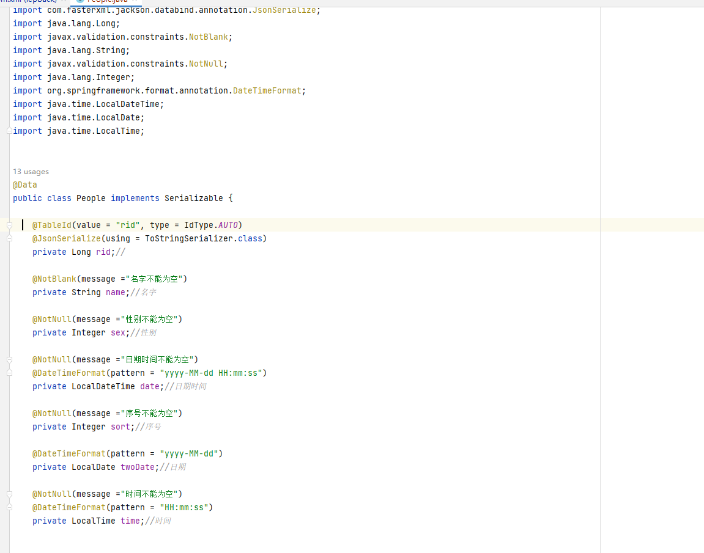
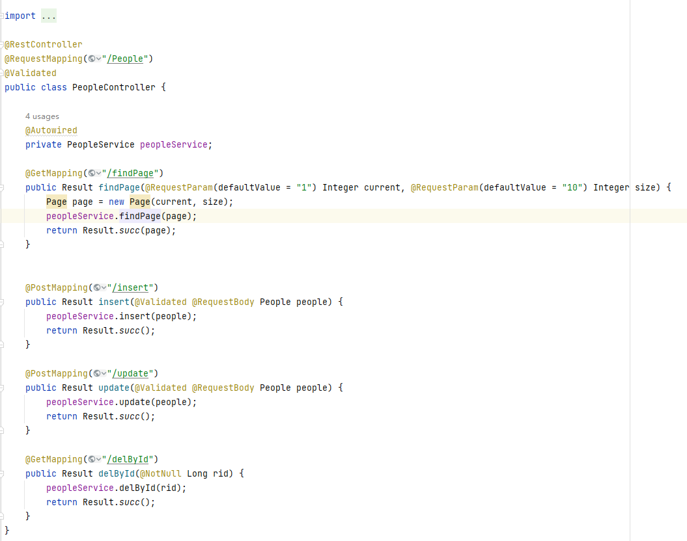
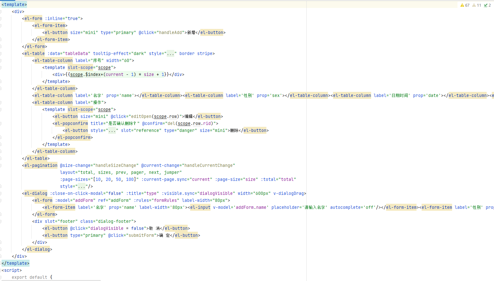
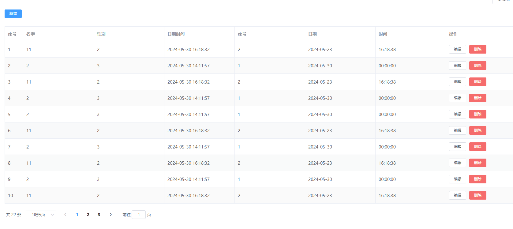

# jsl-code-generate

#### 介绍
 **java的springboot框架代码生成器，支持生成表的分页，删除，新增，修改，支持生成vue页面。支持多表连接和knife注解。生成的代码需要依赖springboot和mybatis-plus框架。** 

#### 使用说明
```
//数据库配置
DataSource dsc = new DataSource();
dsc.setUrl("jdbc:mysql://127.0.0.1:3306/iep?useUnicode=true&useSSL=false&characterEncoding=utf8&serverTimezone=Asia/Shanghai");
dsc.setDriverClassName("com.mysql.cj.jdbc.Driver");
dsc.setUsername("root");
dsc.setPassword("123456");
//代码配置
GenerateConfig generateConfig = new GenerateConfig();
generateConfig.setDataSource(dsc);
String projectPath = System.getProperty("user.dir");
generateConfig.setOutPutJavaDir(projectPath + "/src/main/java");
//报名
generateConfig.setPackageName("com.jsl.codegenerate");
//Controller返回的结果全类名
generateConfig.setControllerResultPackagePath("com.jsl.codegenerate.model.Result");
//是否配置 knife 注解
generateConfig.setEnableKnife(true);
//配置是否多表连接  如果该表分页查询有左连接 设置为 true，并配置左连接的表信息。
generateConfig.setJoin(true);
//开始配置多表左连接
generateConfig.leftJoinInfoBuilder().tableName("student").anotherTableName("b").joinOnTableColumnRules("a.student_id = b.id")
.selectJoinTableColumnName("name").selectJoinTableColumnAnotherName("student_name").joinTableColumnClass(String.class).build().add()
.leftJoinInfoBuilder().tableName("sys_user").anotherTableName("c").joinOnTableColumnRules("a.user_id = c.id")
.selectJoinTableColumnName("name").selectJoinTableColumnAnotherName("username").joinTableColumnClass(String.class).build().add();
//需要生成的表名
AutoGenerator autoGenerator = new AutoGenerator(generateConfig,"behavioral_goal_assessment");
autoGenerator.setDefaultAnalyzes();
autoGenerator.getTlAnalyzes().get("VueElementTableAnalyze").setOutPath("C:\\Users\\Admin\\Desktop");
autoGenerator.execute();
System.out.println("生成成功了------");
```

### entity生成展示
** 

### controller生成展示
** 


### vue生成展示
** 


